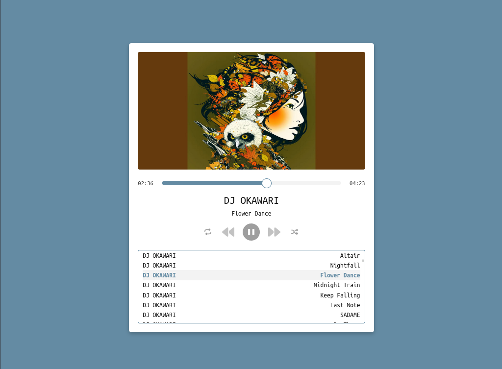

# Muse

Your music, in your browser. Muse is a minimal, self-hostable music player
written in Go with zero dependencies.



## How it Works

Muse locates all mp3 files within the specified directory and all of its
subdirectories.

Each located file is parsed and has its ID3 tags analyzed. Muse uses the artist,
title and album artwork tags for display purposes. No external web requests are
performed.

## Installation & Tool Usage

```bash
# Install the latest tool.
go install github.com/prophittcorey/muse/cmd/muse@latest

# Serve your music.
muse --dir "$HOME/Music" --host "0.0.0.0" --port "3000"

# Open http://0.0.0.0:3000 with any browser on your network.
```

## Settings

If serving over the public internet or simply to add some security you can set
a basic authentication username and password.

```bash
muse --dir "$HOME/Music" --host "0.0.0.0" --port "3000" --auth admin:qwerty
```

If command line arguments are not your thing you can also use environment
variables. The following variables are available for use.

- `HOST`
- `PORT`
- `DOMAIN`
- `BASIC_AUTH`

## License

The source code for this repository is licensed under the MIT license, which you can
find in the [LICENSE](LICENSE.md) file.
